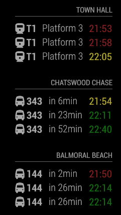

# MMM-NSWLiveTransport
Additional Module for MagicMirror²  https://github.com/MichMich/MagicMirror

# Module: NSWLiveTransport
Magic Mirror Module for UK bus information. Returns real-time info about a SPECIFIC transport stop(s).



## Using the module

Git clone from this repository into the modules sub-directory of the Magic Mirror installation, change directory into the newly cloned code and then run npm install.

```bash
cd MagicMirror
git clone https://github.com/ant2221/MMM-NSWLiveTransport.git
cd MMM-NSWLiveTransport
npm install
```

To use this module, add it to the modules array in the `config/config.js` file:

```javascript
modules: [
    {
			module: 	'MMM-NSWLiveTransport',
			position: 	'bottom_right',				// Position on Magic Mirror to be displayed
			header:		'Town Hall',				// Header title for the module shown on screen
			config: {
				originID:		'10101101', 		//locaion ID for start of journey. Find at https://transportnsw.info/stops
				destinationID:	'10101112',			//locaion ID for end of journey. Find at https://transportnsw.info/stops
				app_key:		'YOUR-API-KEY', 	// TransportAPI App Key from https://opendata.transport.nsw.gov.au/
				limit:			3, 					// Optional - Maximum results to display.
      			nextBuses:		'no',              	// Optional - Use expensive RealTime info from NextBuses
      			showRealTime:	false,          	// Optional - Show realtime departure info
      			showDelay:		false,              // Optional - Show delay in minutes based on Real Time info vs Timetable
				walkTime:		15					// Optional - How long it takes for you to walk to stop location
			}
		},
]
```
For multiple routes, add multiple of the above with different maname and options. 

The following is taken from the TransportAPI documentation [here](https://api.transport.nsw.gov.au/v1/tp/trip)

|Option|Required Settings Description|
|---|---|
|`originID`|String. The transport stop ID you require to depart from.<br><br>This value is **REQUIRED** <br/>**Example**: 10101101 <br />
This information can be found by locating your stop on https://transportnsw.info/stops|
|`app_key`|String. Your TransportAPI app_key [Get yours here](https://opendata.transport.nsw.gov.au/).<br><br>This value is **REQUIRED** <br/>**Example**: z9307fd87b0000c107e098d5effedc97 <br />
Your key then needs to be activated for **"Trip Planner APIs"** when creating the API key. <br> This can be added at https://opendata.transport.nsw.gov.au/ > My Account > Application > YOUR_APPLICATION > API Management |

|Option|Optional Settings Description|
|---|---|
|`updateInterval`| Time between updates in ms. <br/><br/>**Default:** 60000 (1 minute)|
|`limit`|Integer. Number of departures to return.<br><br>**Default:** 5|
|`nextBuses`| depricated mode |
|`showRealTime`| depricated mode |
|`showDelay`| depricated mode|
|`showBearing`| Depricated? Boolean. Show compass direction/bearing of bus. <br><br>**Default:** false|
|`runTime`| intiger. The running time to get to transit stop from magic mirror location. <br> displays departure time as red if it leaves too soon <br> Red < (now() + runTime) < Yellow < (now() + walkTime) < Green <br> If both runTime && walktime are set to 0, display time is white. <br><br>**Default:** 0|
|`walkTime`| intiger. The walking time to get to transit stop from magic mirror location. <br> displays departure time as red if it leaves too soon <br> Red < (now() + runTime) < Yellow < (now() + walkTime) < Green <br> If both runTime && walktime are set to 0, display time is white.  <br><br>**Default:** 0|
|`delaySearch`| intiger. any departures within this many minutes are not include within the results list. Useful when a few transport options may leave within the walkTime period. <br/><br>**Default:** 0|
|`excludeTrains`| boolian. Exclude Trains from search result <br/><br>**Default:** false|
|`excludeLightRail`| boolian. Exclude Light Rail from search result <br/><br>**Default:** false|
|`excludeBus`| boolian. Exclude Bus from search result <br/><br>**Default:** false|
|`excludeCoach`| boolian. Exclude Coach from search result <br/><br>**Default:** false|
|`excludeFerry`| boolian. Exclude Ferry from search result <br/><br>**Default:** false|
|`excludeSchoolBus`| boolian. Exclude School Bus from search result <br/><br>**Default:** false|
|`animationSpeed`| intiger. How quick the refresh animation takes in ms <br/><br>**Default:** 2000|


## Notes ##

To find the OriginID & destinationID of a bus stop look at the https://transportnsw.info/stops transport tool and query the bus stop you are interested in and pulling the ID from the URL of the stop. The name of the bus stop to search is exactly the same as used on citymapper. 

## Transport API

To setup an account for the App_id & app_key sign up for an account here: https://opendata.transport.nsw.gov.au/

## Troubleshooting

If there are issue getting data out of the module I'm ALWAYS going to ask the following:

1. Do you have an account set up at Transport.nsw.gov.au?
2. Do you have an and app_key set up?
3. Do you know the originID & Destination ID for the stop??
4. If you use the live api documentation [here](https://developer.transportapi.com/docs?raml=https://transportapi.com/v3/raml/transportapi.raml##uk_bus_stop_atcocode_live_json) and put in the info you want to use does it respond without an error?
5. Is the info in your config the same as that you’ve used successfully in the live api docs?
6. Please provide your config - at the minimum include the ATCOCode in the report - each operator supplies information slightly differently. While TransportAPI does catch most of these, I might not have.

## Known Bugs

Sometimes finding 'Undefined' transport options, it will show briefcase icon for these with an 'Unidentified' transport ID

## Hope to imporove

This will only show icons for busses & train - wish to also add ferries, and light rail
Wish to add new variables for how long either side of walkTime to turn colours Red/Yellow/Green